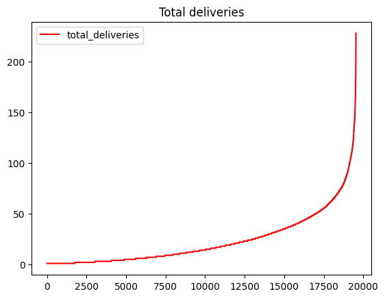
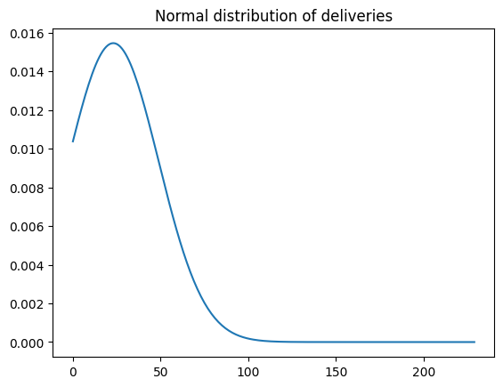
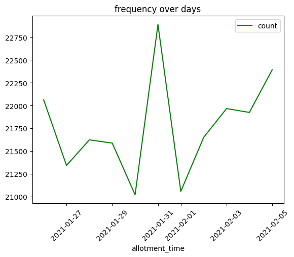
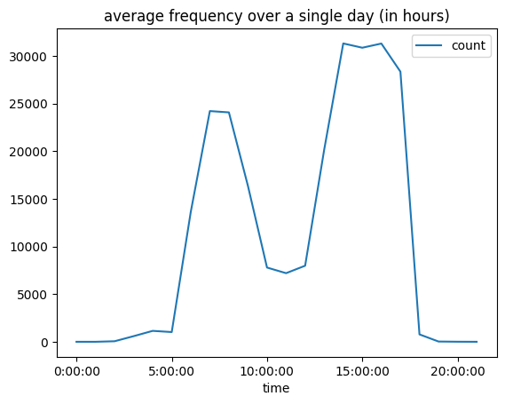
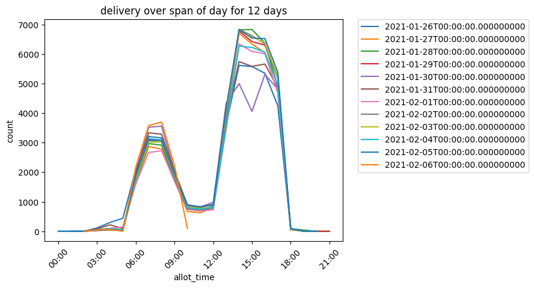

```python
import pandas as pd
from matplotlib import pyplot as plt, dates
from scipy.stats import norm
import numpy as np
from datetime import datetime as dt
from collections import defaultdict
from scipy.interpolate import interp1d
import seaborn as sns
```

<h2> Source-Code: May be ignored for viewing purpose <h2>


```python
class plot_food:
    
    def __init__(self, dfmain):
        self.dfmain = dfmain
        
        
    def plot1(self):

        df= self.dfmain.assign(total_deliveries=[1]*self.dfmain.shape[0])
        df=df.groupby(['rider_id'])['total_deliveries'].sum().to_frame()
        df=df.sort_values(by=['total_deliveries'])
        df=df.reset_index()
        df.plot(kind = 'line',
                y = 'total_deliveries',
                use_index=True,
                color = 'red')

        # set the title
        plt.title('Total deliveries')

        # show the plot
        plt.show()

    def plot2(self):
        df= self.dfmain.assign(total_deliveries=[1]*self.dfmain.shape[0])
        df=df.groupby(['rider_id'])['total_deliveries'].sum().to_frame()
        df=df.sort_values(by=['total_deliveries'])
        df=df.reset_index()

        mean=df.mean()['total_deliveries']
        stnd_dev=df.std()['total_deliveries']
        x_axis = np.arange(0, 230, 1)


        plt.title('Normal distribution of deliveries')
        plt.plot(x_axis, norm.pdf(x_axis,mean,stnd_dev))
        plt.show()

    def plot3(self):
        allot={}
        for i in range(len(self.dfmain)):
            time=dt.strptime(self.dfmain.loc[i, 'allot_time'],'%Y-%m-%d %H:%M:%S')
            allot[time]=self.dfmain.loc[i, "rider_id"]
        #print(allot)
        dict2=sorted(allot, key=lambda date: date)
        df2=pd.DataFrame(dict2)
        df2.columns=['allotment_time']
        df3=df2.groupby(by=df2['allotment_time'].dt.date).count()
        df3=df3.rename(columns = {'allotment_time':'count'})
        df3.reset_index(inplace=True)
        df3 = df3.drop(labels=11, axis=0)
        df3.plot(y='count',x='allotment_time',kind='line',color='green', title="frequency over days")
        plt.xticks(rotation=45)

    def plot4(self):
        allot={}
        for i in range(len(self.dfmain)):
            time=dt.strptime(self.dfmain.loc[i, 'allot_time'],'%Y-%m-%d %H:%M:%S')
            allot[time]=self.dfmain.loc[i, "rider_id"]
        #print(allot)
        dict2=sorted(allot, key=lambda date: date)
        df2=pd.DataFrame(dict2)
        df2.columns=['allotment_time']
        df4=df2.groupby(by=df2['allotment_time'].dt.hour).count()
        df4=df4.rename(columns = {'allotment_time':'count'})
        df4=df4.reset_index()
        newl=[]
        for i in range(len(df4)):
            time=str(df4.loc[i, 'allotment_time'])+':00:00'
            newl.append(time)
        df4['time'] = newl
        #display(df4)
        df4.plot(x='time',y='count',kind='line', title='average frequency over a single day (in hours)')

    def plot5(self):
        df5=self.dfmain.groupby(by=self.dfmain['order_date']).count()
        order_date=self.dfmain['order_date']
        allot_time=self.dfmain['allot_time']
        df5=pd.DataFrame([order_date,allot_time])
        df5=df5.transpose()
        df5date = pd.to_datetime(df5['order_date'])
        df5time = pd.to_datetime(df5['allot_time']).dt.floor('H')
        df5time2 = df5time.apply(lambda dt: dt.replace(month=1,day=1))
        df5time2=df5time2.to_frame()
        df6=pd.concat([df5date,df5time2],axis=1)
        #print(df6)
        df6=df6.groupby(['order_date','allot_time']).size()
        df6=df6.to_frame()
        df6=df6.reset_index()
        df6=df6.rename(columns = {df6.columns[2]:'count'})
        fig, ax = plt.subplots()
        p = sns.lineplot(data=df6, x='allot_time', y="count", hue='order_date', palette="tab10")
        plt.title('delivery over span of day for 12 days')
        plt.legend(bbox_to_anchor=(1.05, 1), loc=2, borderaxespad=0.)
        plt.xticks(rotation=45)
        ax.xaxis.set_major_formatter(dates.DateFormatter('%H:%M'))
```

<h1>//////////////////////////////////////////////////</h1>

<h1> Definition of swiggy/zomato delivery data with context to delivery hours and rider total deliveries</h1>


<h3> We will be looking at </h3>
<ol>
    <li> Deliveries by each partner sorted and plotted</li>
    <li> Normal distribution of the amount of successful deliveries by delivery partners </li>
    <li> Frequency of deliveries over the span of the given 12 days of data </li>
    <li> Average frequency of delivery for any given day over 24 hours </li>
    <li> Exact frequency of deliveries of each day over 24 hour period </li>
</ol>


```python
df= pd.read_csv('Rider-Info.csv')
df.head()
```


<div>
<table border="1" class="dataframe">
  <thead>
    <tr style="text-align: right;">
      <th></th>
      <th>order_time</th>
      <th>order_id</th>
      <th>order_date</th>
      <th>allot_time</th>
      <th>accept_time</th>
      <th>pickup_time</th>
      <th>delivered_time</th>
      <th>rider_id</th>
      <th>first_mile_distance</th>
      <th>last_mile_distance</th>
      <th>alloted_orders</th>
      <th>delivered_orders</th>
      <th>cancelled</th>
      <th>undelivered_orders</th>
      <th>lifetime_order_count</th>
      <th>reassignment_method</th>
      <th>reassignment_reason</th>
      <th>reassigned_order</th>
      <th>session_time</th>
      <th>cancelled_time</th>
    </tr>
  </thead>
  <tbody>
    <tr>
      <th>0</th>
      <td>2021-01-26 02:21:35</td>
      <td>556753</td>
      <td>2021-01-26 00:00:00</td>
      <td>2021-01-26 02:21:59</td>
      <td>2021-01-26 02:22:08</td>
      <td>2021-01-26 02:32:51</td>
      <td>2021-01-26 02:49:47</td>
      <td>11696</td>
      <td>1.5666</td>
      <td>2.65</td>
      <td>46.0</td>
      <td>46.0</td>
      <td>0</td>
      <td>0.0</td>
      <td>621.0</td>
      <td>NaN</td>
      <td>NaN</td>
      <td>NaN</td>
      <td>NaN</td>
      <td>NaN</td>
    </tr>
    <tr>
      <th>1</th>
      <td>2021-01-26 02:33:16</td>
      <td>556754</td>
      <td>2021-01-26 00:00:00</td>
      <td>2021-01-26 02:33:57</td>
      <td>2021-01-26 02:34:45</td>
      <td>2021-01-26 02:50:25</td>
      <td>2021-01-26 03:11:15</td>
      <td>18117</td>
      <td>2.5207</td>
      <td>2.76</td>
      <td>8.0</td>
      <td>8.0</td>
      <td>0</td>
      <td>0.0</td>
      <td>105.0</td>
      <td>NaN</td>
      <td>NaN</td>
      <td>NaN</td>
      <td>3.266667</td>
      <td>NaN</td>
    </tr>
    <tr>
      <th>2</th>
      <td>2021-01-26 02:39:49</td>
      <td>556755</td>
      <td>2021-01-26 00:00:00</td>
      <td>2021-01-26 02:39:57</td>
      <td>2021-01-26 02:40:13</td>
      <td>2021-01-26 02:56:00</td>
      <td>2021-01-26 03:12:46</td>
      <td>18623</td>
      <td>2.2074</td>
      <td>4.80</td>
      <td>1.0</td>
      <td>1.0</td>
      <td>0</td>
      <td>0.0</td>
      <td>66.0</td>
      <td>NaN</td>
      <td>NaN</td>
      <td>NaN</td>
      <td>9.816667</td>
      <td>NaN</td>
    </tr>
    <tr>
      <th>3</th>
      <td>2021-01-26 02:47:53</td>
      <td>556756</td>
      <td>2021-01-26 00:00:00</td>
      <td>2021-01-26 02:48:25</td>
      <td>2021-01-26 02:49:06</td>
      <td>2021-01-26 03:21:51</td>
      <td>2021-01-26 03:41:05</td>
      <td>15945</td>
      <td>2.1894</td>
      <td>6.38</td>
      <td>1.0</td>
      <td>1.0</td>
      <td>0</td>
      <td>0.0</td>
      <td>127.0</td>
      <td>NaN</td>
      <td>NaN</td>
      <td>NaN</td>
      <td>17.533333</td>
      <td>NaN</td>
    </tr>
    <tr>
      <th>4</th>
      <td>2021-01-26 03:06:30</td>
      <td>556757</td>
      <td>2021-01-26 00:00:00</td>
      <td>2021-01-26 03:07:21</td>
      <td>2021-01-26 03:07:57</td>
      <td>2021-01-26 03:31:38</td>
      <td>2021-01-26 04:00:15</td>
      <td>17589</td>
      <td>2.7870</td>
      <td>4.01</td>
      <td>34.0</td>
      <td>34.0</td>
      <td>0</td>
      <td>0.0</td>
      <td>84.0</td>
      <td>NaN</td>
      <td>NaN</td>
      <td>NaN</td>
      <td>1.350000</td>
      <td>NaN</td>
    </tr>
  </tbody>
</table>
</div>


```python
pf=plot_food(df)
```

<h3>Total deliveries by each partner sorted and plotted</h3>


```python
pf.plot1()
```


    

    


Here we see that some of the Delivery partners can be real competetive... upto 200 deliveries in 12 days means 18 deliveries in one day! He/She may be making the meal of up to 18 families really enjoyable!

<h3>Normal distribution of the amount of successful deliveries by delivery partners</h3>


```python
pf.plot2()
```


    

    


However, the average of the deliveries are around 25 to 30 in 12 days, from which we can infer that most of the partners are able to successfully deliver just under 3 to 4 deliveries per day. The delivery partner market is highly competetive, indeed!

<h3>Frequency of deliveries over the span of the given 12 days of data</h3>


```python
pf.plot3()
```


    

    


Here we can see out of the 12 days, there is a huge peak on the 31st of January... Payday, anyone?

<h3>Average frequency of delivery for any given day over 24 hours</h3>


```python
pf.plot4()
```


    

    


We can see here that deliveries peak near about lunch and breakfast-time. Perhaps due to limitations, we could not track the dinner stastistic, but we can surely infer that there is a certain peak near the afternoon-evening time which could provide insight into the demand for faster and greater number of delivery partners at that time!

<h3>Exact frequency of deliveries of each day over 24 hour period</h3>


```python
pf.plot5()
```


    

    


Here is the same but individually graphed for each day for your viewing pleasure!

<h2>Inferences</h2>
<ul>
    <li> The payday effect is real for food delivery orgs. The end/beginning of the month can provide to be really fruitful for business. </li>
    <li> Peak hours prove to be afternoon to late evenings. Number of delivery partners can be increased to match up to the demand</li>
    <li> The competition amongst food delivery agents may be really high. The top 5 to 10% of delivery partners may be responsible for a majority of the deliveries in the pool</li>

<h1> THANK YOU FOR VIEWING MY MINI PROJECT! I hope to get your feedback and valuable comments soon! </h1>
